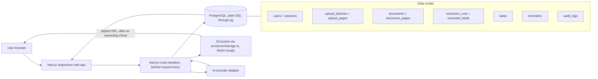

# DayKeeper Group 1 - Technical Stack Recommendation

> **Corrected, not rewritten.** This document was written before the decisions
> in `docs/architecture/` were taken, and the parts that taught something the
> project no longer does have been brought into line with them. Where anything
> here still disagrees with an ADR, **the ADR wins**. Recommendations that
> nobody has decided yet are marked as open rather than presented as settled.

Date: 31 July 2026  
Author: Sai / Group 1 working note  
Status: Draft for team discussion  
Amended: 2 August 2026 (review pass)  
Revised: 18 August 2026 (aligned to ADRs 001-008)

## 1. Executive Recommendation

DayKeeper should be built as a **responsive web application**, not a native mobile app. The recommended stack is:

| Layer | Recommended choice | Why |
|---|---|---|
| Web framework | **Next.js + TypeScript + App Router** | Full-stack React framework, good for dashboards, route handlers, server components, and fast prototyping. Official docs list Next.js as a framework for full-stack web apps and current docs use the App Router path. |
| UI | **Tailwind CSS + shadcn/ui + lucide-react** | Fast dashboard UI, accessible components, consistent design, minimal custom CSS. |
| Auth | **Our own `users` table and database sessions, behind one function** (ADR 002) | Nobody has to own a cloud project before the team can run the app, and every caller reaches authentication through `requireUser()`, so swapping in a managed provider later replaces one file rather than the schema. |
| Authorization | **`requireUser()` plus user-scoped queries** | Every query carries the user id in its `WHERE` clause and a test proves one person's document is invisible to another. Row level security is not used: all database access goes through our own server, so the queries are the gate. |
| Database | **PostgreSQL in Docker, spoken as plain SQL through `pg`** (ADR 003) | No ORM. `db/schema.sql` is the only definition of the database and `npm run db:reset` rebuilds it; there are no migration files. |
| File storage | **An S3-protocol bucket from the first day**: MinIO in `docker-compose.yml` locally, reached only through `src/server/storage.ts` | Uploaded photographs never go in the database and never touch the server's disk. The endpoint and the credentials are environment variables, so moving to a real bucket moves nothing else. |
| AI/OCR integration | **Provider adapter layer**: mock provider by default, the real reader behind the same interface once RACE grants access, no personal keys ever | Do not lock the app to one model provider before resource access is confirmed. |
| AI output contract | **Zod schema in `src/lib/contract/`** | Extraction output must be predictable: six snake_case fields, each with a value and a status. The contract lives in code with a validator attached, not as an example in this document. |
| Background work | **A route handler that answers immediately; the interface polls `GET /api/home`** | ADR 001. What performs the reading after the response has gone out (in-process, a sweep over `extraction_runs`, or a queue) is still open; see "Deliberately not specified" in `docs/api.md`. |
| Reminders/notifications | **Rows planned at confirm time by `planReminders()`; a dispatcher reads the task when each row's moment arrives** | ADR 007. Open at that moment means send, ticked means write `skipped`. In-app is the only channel that exists; what wakes the dispatcher is still open. |
| Evaluation layer | **Offline Python workspace (uv, pytest, opencv, Augraphy)** | Scores extraction quality against labelled fixtures; never deployed, costs nothing. Since nobody edits a reading, this is the only accuracy signal there is. See the Evaluation section. |
| Testing | **Vitest + Playwright** | Unit/schema tests for contracts and E2E tests for upload-confirm-reminder flows. |
| Deployment | **Docker Compose locally; the host is not chosen** | Ordinary Postgres and an ordinary S3 bucket, so nothing in the stack forecloses the choice. It belongs to whoever owns the deployment. |

Short version: **Next.js + TypeScript + our own auth + Postgres through `pg` + an S3 bucket + Tailwind/shadcn + Zod + Vitest, plus an offline Python evaluation workspace.**

## 2. Project Requirements That Drive the Stack

The technology choices should fit these product requirements:

- The product is a **website** usable on mobile, tablet, and desktop.
- Phase 1 focuses on:
  - Module 1: document photo upload and AI extraction.
  - Module 4: unified archive, tasks, reminders, user registration, admin dashboard.
- Uploaded documents may contain sensitive information.
- AI extraction can be wrong, so the reader must be able to say how sure it is:
  - `confirmed`
  - `uncertain`, kept in storage as evaluation data and shown to nobody
  - `unreadable`, which is what `uncertain` collapses to on the way out
  - a person sees the reading and accepts it before any task or reminder exists.
- Future scope may include:
  - Email channel.
  - Voice/call channel.
  - Organization/admin dashboard.
  - Permissioned worker access to client records.

This means we should avoid a toy frontend-only app. We need auth, storage, database permissions, structured extraction, and an auditable workflow.

## 3. Recommended Architecture



One application, one server. The browser never talks to storage or to a model
provider on its own: photographs are posted to our route, and the only thing
that ever goes straight from the bucket to the browser is a page image, through
a redirect the application signs after checking who owns it.

## 4. Frontend Choice

### Recommended: Next.js + TypeScript

Use:

- `Next.js`
- `TypeScript`
- `App Router`
- `src/` directory
- `npm`

Why:

- Next.js is designed for full-stack React web applications, so one project can contain UI pages, server-side handlers, and API routes.
- App Router is the newer routing model and supports modern React features such as Server Components.
- This project is dashboard-heavy, not animation-heavy, so Next.js is a strong fit.

Suggested setup:

```bash
npx create-next-app@latest day-keeper-group-1 --src-dir
```

The repository runs on npm: `npm ci` installs exactly what `package-lock.json`
says, and the lockfile is committed with any change that moves it.

Recommended options:

- TypeScript: yes
- ESLint: yes
- Tailwind: yes
- App Router: yes
- Import alias: `@/*`

### UI styling

Use:

- `Tailwind CSS`
- `shadcn/ui`
- `lucide-react`

Why:

- Tailwind is fast for responsive dashboard layout.
- shadcn/ui gives ready-made components such as buttons, dialogs, forms, tabs, tables, badges, dropdowns, and calendars.
- lucide-react gives clean icons for photo upload, camera, calendar, alert, check, admin, and document actions.

Do not over-design the UI as a marketing landing page. DayKeeper is an operational dashboard: documents, tasks, reminders, review states, and admin panels should be easy to scan.

### PWA and text scale

- Ship a web app manifest and installability from the start. It costs nothing, gives users a home screen icon, and is the prerequisite for web push on iOS later.
- shadcn defaults are tuned for dense professional dashboards. Raise the base type scale and spacing globally in the design tokens for this product's audience. Do it once in the tokens, not per component. The numbers are settled: body text at least 18px, primary buttons at least 48px tall, body contrast at 7:1, nothing blue, colour never the only signal. The palette lives in `src/app/globals.css` and the reasoning in `docs/theme.md`, which is worth reading before styling a screen.

## 5. Authentication And Authorization

### Adopted auth: our own users table, behind one function

ADR 002 settled this. A `users` table of our own, passwords hashed with scrypt
from Node's standard library, and sessions as rows in a `sessions` table keyed
by the SHA-256 of a random token held in an httpOnly cookie.

The decision that matters is not the hashing, it is the seam. Every caller
reaches authentication through exactly one function, `requireUser()` in
`src/server/auth/session.ts`, and nothing else in the application knows how
somebody is authenticated. That makes the choice reversible: adopting a managed
provider later replaces one file, and the other seventy do not change.

Why not a managed provider now:

- somebody has to own the cloud project and hand out credentials before anyone
  can run the app, and shared or personally paid accounts are banned here
- the deployment host is not confirmed, so the provider might not be allowed
- a provider keeps users in its own `auth.users` schema, and every table that
  references a person then points at it, which makes leaving it a schema
  rewrite rather than a swap

Registration and sign-in exist as endpoints in `docs/api.md` and are
deliberately low priority. The seeded accounts (`margaret@example.com` and
`operator@example.com`) work today, and features are worth more than a login
screen this sprint.

Suggested roles:

| Role | Meaning |
|---|---|
| `user` | Normal DayKeeper user. Uploads own documents and confirms tasks. |
| `org_worker` | Worker from an organization who can access only authorized clients. Future scope. |
| `org_admin` | Organization-level admin. Manages workers/clients. Future scope. |
| `platform_operator` | System operator. Can view operational health, not private user document content by default. |

All four are in the `user_role` enum; only `user` and `platform_operator` are
implemented this semester. The organisation roles are named because the project
description anticipates them and adding an enum value later is not free.

The tables, as `db/schema.sql` actually declares them:

```text
users
sessions
upload_batches
upload_pages
grouping_runs
documents
document_pages
extraction_runs
extracted_fields
matching_runs
tasks
reminders
audit_logs
ai_prompt_logs
document_search    a view, not a table
```

Naming note: this document once proposed renaming ai_prompt_logs to extraction_logs. The schema kept the original name, because reading a letter is only one of the three jobs a model does here (dividing a pile and placing a letter against the archive are the others) and all three write prompts to it. It stores the prompts and outputs sent to providers, written by the adapter on every call and read by the evaluation workspace and during debugging.

Schema note: organizations, organization_memberships and document_permissions are not in the schema at all, and neither is a notifications table. Organisation features are future scope, and under the no-migrations rule adding a table later is one edit to db/schema.sql and one npm run db:reset, so carrying empty tables buys nothing. audit_logs does exist, because the promise the admin dashboard makes on screen is that letter content is never visible there, and that promise is only worth anything if the table has nowhere to put it.

Important rule:

> Authentication answers "who is this user?" Authorization answers "what is this user allowed to see or do?"

For this project, authorization is more important than usual because documents may include bills, medical letters, government forms, and personal information.

### Database access pattern

Authorization is enforced in the queries. Every one of them is scoped by user
id, `requireUser()` is what supplies that id, and no handler is allowed to take
one from the request. Row level security is not used: all database access goes
through our own server, so there is no untrusted connection for a policy to
police, and a second place to write the rule is a second place for it to drift.

Two rules keep it real:

1. A query that touches a person's data and does not carry their user id is a
   bug, not a shortcut. There is no service-role connection and no escape
   hatch that bypasses ownership.
2. The route that hands out a link to a photograph is where ownership is
   checked, not the link. A signed URL expires; it never asks who is holding
   it.

The test "another user cannot view the document" in the testing section is what
proves both.

There is no email sender, and nothing that needs one is built: password reset,
email verification and the "your letters are ready" notification are all listed
as open in `docs/api.md`. In-app is the only channel that exists today.

### Why not a managed provider, or Auth.js

Both were considered. Either still leaves the work that actually matters here:

- database authorization still has to be designed, because ownership lives in
  our queries either way
- private file storage is still ours to arrange
- organization membership access control is still ours to write
- uploaded documents still have to be protected by the route that serves them

What they add is a dependency that has to be provisioned before a teammate can
run the app, and, in a managed provider's case, a schema our tables would then
be built on. For a prototype with synthetic data, a hundred lines we control
beats a dependency we cannot provision this week, given that the interface
between them is one function either way. This is not a claim that hand-rolled
authentication is better in general. For anything with real users it is not.

### When to revisit this

Revisit when one of these becomes true:

- the deployment host is settled and offers an identity service the client and
  RMIT accept,
- real users' data is in the system, at which point maintaining our own stops
  being the cheaper option,
- or organisation membership arrives and brings access control worth buying
  rather than writing.

The cost of revisiting is bounded on purpose: one file behind `requireUser()`.
What must not happen is a second way to answer "who is this" appearing beside
the first.

## 6. Database Design

### Adopted: Postgres with relational tables + JSONB

Plain SQL through `pg`, no ORM, and `db/schema.sql` as the only definition of
the database. There are no migration files: to change the shape you edit that
file and run `npm run db:reset`, which drops everything, rebuilds and reseeds.
That is safe while there is no data anyone can lose, and it is a decision with
an expiry date; ADR 003 says so and `db/reset.ts` refuses to run against a
non-local database without an explicit override.

Use relational tables for stable product entities:

- users and sessions
- upload batches and their pages
- documents and their pages
- tasks
- reminders
- audit logs

Use `JSONB` for the variable part of a reading:

```text
documents
  id
  user_id
  status
  issuer / document_type / due_date / due_time / amount_text / reference
  open_payload jsonb      anything returned that is not one of the six
  summary                 an index for matching, never a screen
  uploaded_at / confirmed_at / archived_at

extraction_runs
  id
  document_id
  attempt
  provider
  model
  status
  contract_version
  raw_response jsonb      exactly what the provider said, before validation
  started_at / finished_at / duration_ms
```

The denormalised columns on `documents` are written only from confident values.
A hedged date or an unreadable reference stays NULL there, because a value the
model was not sure of never reaches the documents table, the calendar or a
screen (ADR 008). The per-field detail of each attempt lives in
`extracted_fields`, which the reading is the only writer of: there are no
correction columns, because nobody edits a reading in this version.

Why JSONB:

- A bill, medical letter, insurance document, and government form do not share the exact same schema.
- The action core should be typed.
- Extra extracted fields can live in a flexible payload.
- Postgres JSONB supports querying and indexing if needed.

### Contract JSON

Every extraction result follows a strict contract, at version 2.0:

```json
{
  "contract_version": "2.0",
  "provider": "mock",
  "model": null,
  "fields": [
    { "key": "document_type", "value": "Electricity bill", "status": "confirmed" },
    { "key": "issuer", "value": "AGL Energy", "status": "confirmed" },
    { "key": "action_required", "value": "Pay the amount due", "status": "confirmed" },
    { "key": "due_date", "value": "2026-08-15", "status": "uncertain" },
    { "key": "amount", "value": "$347.60", "status": "confirmed" },
    { "key": "reference", "value": null, "status": "unreadable" }
  ],
  "open_payload": { "billing_period": "12 May to 11 Aug" }
}
```

Six fields are a floor, not a ceiling: a provider that returns more is not
punished, the extra lands in `open_payload`, and a payload missing one of the
six is rejected. A field the reader could not read must say `unreadable` rather
than be omitted, because silence and "I could not read this" are different
answers. `due_time` is an optional seventh key, present only when the page
prints a time, and its presence is what makes a document an appointment for
reminder scheduling. The hedged `due_date` in the example above never reaches a
screen: the server collapses `uncertain` to `unreadable` on the way out.

Evidence geometry (page and bounding box) was in the first draft of this contract and is still deferred. The only extractor is a vision LLM, and current vision models return approximate, run-to-run unstable coordinates, so a mandatory bbox would be filled with plausible fiction that nothing reads anyway. `raw_text`, the transcription snippet this document used to put beside each value, went the same way in contract 2.0: it was designed as an OCR by-product, and without an OCR stage it is the same model testifying twice, which is evidence of nothing. ADR 008 has the reasoning and the review screen's answer to checking is different now. Both can come back if the experiment line brings OCR back, and both come back with the independence that was their point.

Four things this document left open, and where they landed:

- `amount` travels as the page writes it (`"$347.60"`) and is stored in `documents.amount_text`. There is no separate currency key: the string is display text and nothing does arithmetic on it.
- `due_date` is a calendar day, `'YYYY-MM-DD'`, never a timestamp and never a zone. `users.timezone` says whose morning "9 am" means, and the helpers that keep it that way are in `src/lib/contract/dates.ts`.
- The no-action case is expressible through two constants in `src/lib/contract/fields.ts`: `NO_PAYMENT_REQUIRED` for an amount, `NOT_APPLICABLE` for anything else. A document that requires nothing is a first-class result, and a row carrying either constant is hidden on screen rather than dropped from the data.
- The extension slot is `open_payload`, an untyped record beside the six fields, which is what justifies the JSONB column. `due_time` is the one key that graduated out of it into the contract.

`Zod` validates this at runtime, in `src/lib/contract/extraction.ts`. TypeScript alone is not enough because AI output and API responses are untrusted runtime data.

## 7. AI/OCR Stack

### Recommended design: provider adapter

Do not directly scatter OpenAI/Claude/Bedrock calls across the app. Create one interface:

```ts
export interface DocumentExtractionProvider {
  readonly name: string;             // stored on every run
  readonly model: string | null;     // the exact model id, when there is one
  extract(input: ExtractionInput): Promise<unknown>;
}
```

The return type is `unknown` on purpose. A provider is never trusted: whatever
it hands back is validated against the contract before it is allowed anywhere
near the database. `ExtractionInput` carries the document id, which attempt this
is, and one entry per photographed page.

The adapter fetches file bytes server-side from storage. Signed URLs must not be handed to external providers: that would send user documents outside our infrastructure as links, and these APIs want bytes anyway.

The files, as they exist:

```text
src/server/extraction/provider.ts       the interface, and MAX_ATTEMPTS
src/server/extraction/mock-provider.ts  the default; no credentials, runs today
src/server/extraction/<real>.ts         the real reader, once RACE grants access
```

The mock comes first so that the interface and the backend can be built before
any access arrives, and it misbehaves on purpose: it takes seconds, hedges on
the due date about half the time, cannot read the reference about one time in
five, and fails outright about one document in eight. A mock that always
succeeds instantly produces an interface with no waiting state and no failure
path, and both are where this product actually lives.

Do not presume the platform for the real one. RACE's own catalogue decides
whether that file talks to Bedrock, to Azure OpenAI or to something else, and
that conversation is not finished. Meanwhile a provider name that is configured
but not implemented throws rather than silently falling back to the mock,
because silently fabricating readings of real letters is the worst thing this
system could do.

Any fallback beyond what RACE grants is deliberately unfunded: personal keys and personal paid cloud are banned (see What Not To Do), and free consumer API tiers are not an acceptable place to send medical or financial documents. The zero-cost fallback for experiments is a Tesseract text-only baseline inside the evaluation workspace, not a second cloud provider.

A separate Python API service was considered and rejected for the MVP: it adds a second deployment surface for a call that is one HTTP request in either language. Python earns its seat in the evaluation layer instead (see the Evaluation section).

### Recommended AI output mode

Use structured output where the granted platform offers it:

- an image-input API with structured outputs, whichever vendor RACE lands on.
- Always validate final output with the contract validator before saving.

Critical rule:

> The model is allowed to say uncertain or unreadable. It should not guess.

### OCR/vision pipeline for MVP

The pipeline, as ADR 005 and ADR 008 leave it:

```text
Post a pile of photographs (up to 10, up to 10 MB each)
-> store the bytes in the bucket, answer with the batch
-> one vision pass divides the pile: a manifest of letters, in reading order,
   plus the photographs that are no letter at all
-> create one document per letter, each with a label from its letterhead
-> read each letter's six fields; validate against the contract
-> save the reading; the row turns from "reading" to "ready to check"
-> the person looks at it and confirms; nothing on that screen is editable
-> the task is created and planReminders() writes its reminder rows
```

There is no grouping confirmation screen. A grouping mistake does not hide: two
letters merged show one card whose fields contradict each other, one letter
split shows two cards with half their fields unreadable, and both land on the
review screen the person is already reading.

Optional later improvements:

- a capture-time blur check, which the capture screen currently promises and no provider method delivers; listed as open in `docs/api.md`
- OCR second opinion, which would also bring `raw_text` back with its independence
- model comparison experiments, including small fast models for the dividing pass
- synthetic test documents
- batches of known composition, to measure how often the dividing pass gets it wrong

## 8. File Storage

Do not store uploaded document files directly inside Postgres.

Adopted (ADR 003):

- an S3-protocol bucket from the first day: the MinIO in `docker-compose.yml` locally, whatever the host provides later.
- Every read and write of those bytes goes through `src/server/storage.ts` and nowhere else.
- Postgres holds the key and the metadata; nothing is written to the server's own disk.
- Links to a photograph are signed and short-lived, and the route that hands one out is where ownership is checked.

Storage path, as the code writes it:

```text
uploads/{user_id}/{batch_id}/{position}.{ext}
```

Three things follow from that shape. The person is the first segment, so
everything one account owns is one prefix and deleting it is a prefix
operation. The batch is the second, so a pile stays together however the
reading later divides it into letters. And the key is derived rather than
random, so a retried upload writes over itself instead of leaving a twin that
nothing references. There is no document in the path because at upload time
there is no document yet: `document_pages.storage_path` points back at this
same object once the letters exist, rather than copying the bytes under a
second key.

The earlier proposal here was `documents/{user_id}/{document_id}/original.{ext}`
with a `preview.webp` beside it. Both halves are gone: documents are born after
the upload rather than before it, and a second stored rendition is a second
thing to keep in step.

### Upload path (a pile, through our own route)

Photographs are posted to `POST /api/documents` as `multipart/form-data`, up to
`MAX_PAGES` (10) files of `MAX_PAGE_BYTES` (10 MB) each, all or nothing. The
route stores the bytes, creates the batch, and answers immediately with the
batch rather than with a document, because at that moment nothing knows what is
in the pile. Import both limits from `src/lib/contract/api.ts` so the capture
screen can stop the person at page ten rather than rejecting ten deliberate
photographs at the end.

The browser never talks to storage directly on the way in. Going the other way,
a page image is served by `GET /api/documents/:id/pages/:page`, which checks
ownership and then redirects to a short-lived signed URL, so the bytes travel
from the bucket to the browser without passing through the application and
without a link that outlives the check.

What the capture screen does at those limits, and how it holds the camera open
between shots, are open questions. `docs/api.md` lists both under "Deliberately
not specified" rather than guessing at them.

### Upload normalization (after storage, before anything else sees the image)

Normalize every upload in one pass:

- HEIC: do not list image/heic in the upload accept attribute, so iOS Safari converts to JPEG client-side on its own; for files that still arrive as HEIC, decode with heic-convert and hand the result to sharp (sharp's prebuilt binaries ship no HEIC decoder)
- apply EXIF orientation, then strip it
- downscale the longest edge to 1568 px (a common vision tier's long-edge cap; adjust to whatever RACE grants) and store a webp working copy alongside the original

This is still a proposal, not a decision. One code path, two wins and one open
question: AI payloads shrink roughly 10x (faster and cheaper calls), photos stop
arriving sideways, and storage still grows by roughly the original's size per
upload, so somebody has to decide how long originals are kept beside the working
copy. If it lands, it lands inside `src/server/storage.ts` and its callers,
which is the one place in this system that touches bytes.

## 9. Background Jobs

Document extraction should not block the browser request for too long.

### MVP approach

Use:

- `extraction_runs.status`
- a Next.js route handler that answers immediately
- polling from the interface every few seconds, one request for everything (`GET /api/home`)

Statuses, in three separate vocabularies:

```text
run_status        queued | processing | succeeded | failed
document_status   processing | needs-review | confirmed | failed | archived
field_status      confirmed | uncertain | unreadable
```

They do not overlap by accident. A run is one attempt at one of the three jobs a model does here: dividing a pile, reading a letter, placing a letter against the archive. A document's status is where the letter is in its life, and `confirmed` there means a person accepted it, not that a model succeeded: only the person confirms. A field's status is the model's own assertion about one value, and `uncertain` never leaves storage, because the server collapses it to `unreadable` on the way out (ADR 008).

The route wraps the provider call in try/catch and writes `failed` plus a failure kind on any exception. Something also has to notice a run stuck in `processing`, so the interface never polls forever; what does that noticing is part of the open question below.

### Extraction venue (measured, not assumed)

Extraction runs inside a route handler that answers immediately and lets the interface poll (ADR 001). A single vision call on a downscaled image is seconds rather than minutes, so there is no queue and no second runtime, and the reason to ever move it would be reliability and user experience, not a timeout ceiling.

What actually performs the reading after the response has gone out is still open: in-process after responding, a sweep over the `extraction_runs_status_idx` index, or a real queue. The schema supports all three and nobody has chosen; `docs/api.md` lists it under "Deliberately not specified". If extraction ever needs to run for minutes rather than seconds, ADR 001 says that is when this gets revisited.

BullMQ + Redis stays out of scope: it needs a persistent worker process, which is a second runtime to deploy and to explain, and nothing here needs one yet.

### Reminders and notifications

What the system decides is settled (ADR 007). How it is woken up is not.

- reminder rows are planned at confirm time by `planReminders()` and by nothing else: a deadline gets three reminders, 7, 3 and 1 days before, at 9 am in the person's own zone; an appointment (anything carrying a `due_time`) gets one, the day before; a moment already in the past is never created
- ticking a task writes nothing to reminders, and unticking writes nothing back. When a row's moment arrives the dispatcher reads the task at that moment: still open means send and write `sent`, already done means send nothing and write `skipped`. That is the product's only judgement about whether to nag, and it lives in the one place that sends
- `reminder_status` is `scheduled | sent | skipped | failed`. There is no `cancelled`, because nothing writes it; a cancel-on-complete transaction was specified once and is dead

What wakes the dispatcher is open: a cron job, a platform scheduler, or in-app only. Whatever it turns out to be, the check is the same three lines.

Channels for the MVP, in honesty order:

- in-app: the only channel that is guaranteed free and unblocked
- email: blocked until the team controls a verified sender, and no service has been chosen. Password reset and the batched "your letters are ready" message wait on the same thing. Record it in the A1 risk register; a free SMTP provider with single-sender verification is the likely unblock
- web push: later; the PWA manifest is its prerequisite

## 10. Deployment Options

### The host is not chosen

Nothing in the stack forecloses the choice, and that is deliberate. It is
ordinary Postgres and an ordinary S3-protocol bucket, so any host that offers
both will do, and the decision belongs to whoever owns the deployment.
`docs/api.md` lists it among the things deliberately not specified.

What the choice has to satisfy:

- data and privacy requirements that the client and RMIT set
- a Postgres the app can be pointed at with `DATABASE_URL`
- a bucket the app can be pointed at with `STORAGE_ENDPOINT`
- no personal account and no personally paid plan anywhere in it

Whatever is chosen, register it under a team address rather than anyone's
personal login. The project has to hand over cleanly at semester end.

### Free tier operations (read before demo week)

The traps below were written against one particular pair of free tiers, and
they are kept because the shape of each is the same wherever this lands:

- one seat means one account. The project lives under a team-owned login and teammates deploy by merging to main, not from a personal account. Free tiers are also commonly licensed for non-commercial use only, so a deployed demo URL is coursework, not the handover target.
- free databases pause when nothing touches them, and a paused database on demo day is the classic failure of this kind of stack. If the host does that, a daily scheduled job doing a real write is the cheap insurance; a weekly ping has no margin.
- preview deployments usually point at the one shared database, so a preview is production data. Say it out loud in the team. The development default stays local: `docker compose up -d` and `npm run db:reset`, which nobody can point at anything shared.
- the handover artifact is the Docker Compose stack, built and verified once at a scheduled rehearsal (around week 10), not maintained continuously as a second deployment path. Any commercial continuation after the semester needs paid hosting anyway.

### Alternative: Docker self-hosted

Use if client/RMIT requires controlled hosting:

```text
Docker Compose
  nextjs-app
  postgres
  minio
```

This is not hypothetical: `docker-compose.yml` already runs the last two on
every teammate's laptop, with viewers on 8080 and 59001. MinIO is not optional
in it. It is the storage the application uses, locally and in this deployment
shape alike, which is exactly why the migration everybody worries about has
already been rehearsed.

Pros:

- more control
- easier to explain as portable deployment
- no vendor lock-in
- the same two services the team already runs, plus the app

Cons:

- slower setup
- somebody has to operate it: backups, certificates, upgrades
- deployment is more work

## 11. Evaluation And Experiments (Python, Offline)

The app runtime is TypeScript end to end. Alongside it, the repo carries an offline evaluation workspace in Python (managed with uv), because the tooling for this layer lives in Python: image degradation libraries such as Augraphy, opencv and Pillow for image quality measurement, pytest for harness discipline.

What it is for:

- scoring extraction output against labelled fixtures: per-field accuracy, and false positives on documents that require no action
- comparing providers, models and prompts before changing adapter defaults
- generating and checking synthetic test fixtures (the AI/OCR section already lists these as a planned improvement)

The boundary is the Contract JSON: the harness consumes exactly what the adapter emits. It is not deployed, costs nothing to host, and any team member can run it locally. Its results feed back into the app only as configuration: prompt text, model choice, few-shot examples.

This layer carries more weight than it did when the section was written. Nobody edits a reading any more, so there are no user corrections to compare against extracted values (ADR 008), and accuracy measurement rests entirely here, where ground truth is known by construction. The dividing pass needs the same treatment: batches of known composition, compared against the manifest the reader returns, is a binary judgement per photograph and the number that decides whether ADR 005 holds.

One promotion this document called for has happened: the contract lives in code, as `src/lib/contract/extraction.ts`, a Zod schema with a validator and a version, covered by `tests/contract.test.ts` and changed through pull requests. A JSON Schema export for the Python side is the remaining half.

## 12. Testing Strategy

Use three levels:

| Test type | Tool | What to test |
|---|---|---|
| Schema/unit tests | Vitest | Contract JSON validation, due-date parsing, status transitions. |
| Component tests | Vitest + Testing Library | Review card, task card, calendar day sheet wording, role-based UI states. |
| E2E tests | Playwright | Sign in, post a pile of photographs, letters appear, person confirms, task and reminders created. |

All tests run against the mock provider in CI, so results stay deterministic and free. The mock is deterministic by document id, so a test can assert on its output and a demonstration surprises nobody.

Minimum tests before demo:

- A seeded account can sign in.
- A pile of photographs becomes one row per letter, and a photograph that is no letter becomes none.
- A field the model was not sure of appears on no screen and in no response.
- A letter with a clear action and no clear date becomes a task with no date and no reminders.
- Confirming is an empty POST, creates the task, and plans the same reminders the card showed.
- Ticking a task writes nothing to reminders, and a reminder whose moment finds the task done writes `skipped`.
- Another user cannot view the document.
- Admin/operator views do not expose private document content unless permission allows it.

## 13. Suggested Folder Structure

```text
day-keeper-group-1/
  src/
    app/
      (auth)/            login, register, forgot-password
      (app)/             dashboard, documents, tasks, settings, admin
      api/
    components/
      ui/
      layout/
    lib/
      contract/          the six fields, the manifest, dates, reminders
      mock-data.ts       what the pages read until they are wired up
    server/
      auth/              session.ts, password.ts, token.ts
      db.ts
      storage.ts
      extraction/
  db/
    schema.sql           the only definition of the database
    seed.ts
    reset.ts
  tests/
  docs/
    architecture/
    prototype/
```

`src/lib` is safe to import anywhere; `src/server` is marked `server-only`, so a
component that reaches for it turns a leak into a build error rather than a
discovery. There is no `supabase/migrations/` directory and there is not going
to be one: the schema is one file.

## 14. Team Workflow

Use GitHub with:

- branch per feature
- pull requests
- code review before merge
- GitHub Issues or Jira ticket link in PR description

Branch naming: start with the Jira ticket key when there is one, because Jira
then attaches the branch and its pull request to the ticket by itself and the
board stays wired to the code with no manual linking.

```text
kan-13-photo-upload
<ticket-key>-<short-description>
```

Recommended PR checklist:

```markdown
## What changed

## How to test

## Jira ticket
```

## 15. What Not To Do

Avoid these choices for Phase 1:

- Do not build a native mobile app.
- Do not make the product a chatbot-first interface.
- Do not put uploaded files directly in Postgres, or on the server's disk.
- Do not call AI APIs directly from the frontend.
- Do not create a microservice architecture at the beginning.
- Do not introduce Module 2 and Module 3 into the core MVP before Module 1 and Module 4 work.
- Do not automatically execute high-risk actions from AI output without user confirmation.
- Do not rely only on model confidence scores.
- Do not use personal API keys or personal paid cloud resources.
- Do not add an ORM, migration files, or any second definition of the schema.
- Do not add a way to edit a reading. The remedy for a wrong or missing value is photographing the letter again, and every "just a small text box" proposal reintroduces the exam ADR 008 removed.

## 16. Recommended MVP Milestones

### Milestone 1: Project foundation

- Next.js app created.
- `docker compose up -d` brings up Postgres and MinIO; `npm run db:reset` builds the schema and seeds it.
- `requireUser()` and the seeded session, so protected endpoints can be called before sign-in exists.
- Basic dashboard layout.
- GitHub/Jira workflow ready.

### Milestone 2: Document upload and archive

- A person posts a pile of photographs to `POST /api/documents`.
- Bytes land in the bucket under `uploads/{user}/{batch}/{position}`, and the batch is answered immediately.
- The dividing pass turns the batch into one document per letter, with the photographs that are no letter named as such.
- Upload normalization decided (HEIC, EXIF orientation, downscale).
- User sees document archive.
- Retention rule for originals decided (keep both, or discard originals after confirmation).

### Milestone 3: Extraction contract

- Contract JSON schema created with Zod.
- Mock extraction provider implemented.
- Extraction result saved to database.
- Exit check: as soon as real model access arrives, measure real extraction latency, then choose the runner and the downscale target on measured numbers.

### Milestone 4: Confirm box

- The reading is shown read-only; rows without a confident value are not drawn at all.
- When the date or the action is missing, the card says so in one plain sentence.
- Confirming is an empty POST whose only error is "already confirmed".
- The one remedy offered anywhere is photographing the letter again, and the matching step is what reconnects the new photographs to the letter.

### Milestone 5: Tasks and reminders

- Confirming creates the task and, through `planReminders()`, its reminder rows.
- A person can tick a task off and untick it, from the home list and from the calendar day sheet, with no "too late to change your mind".
- Dashboard shows every open task whatever its date, due date ascending, so an overdue one sorts to the top.
- Reminder delivery works end to end: rows planned at confirm, a dispatcher that reads the task when each moment arrives, in-app delivery.

### Milestone 6: Admin/operator prototype

- Admin dashboard exists.
- Platform operator can see system status.
- Organization features remain clearly marked as future/optional unless client prioritizes them.

## 17. Decision Summary

The best default stack is:

```text
Next.js
TypeScript
Tailwind CSS
shadcn/ui
Our own users table and sessions, behind requireUser()
PostgreSQL through pg, schema in db/schema.sql, no migrations
An S3 bucket behind src/server/storage.ts, MinIO locally
Zod
A provider adapter with a mock default, real model access through RMIT RACE
Vitest
Playwright
Docker Compose locally; deployment host undecided
Offline Python evaluation workspace (uv)
```

The most important design decision is not the exact model provider. It is this:

> DayKeeper must be built around user confirmation, permissioned access, and structured extraction data.

If the team gets those foundations right, the AI model can be swapped later.

## 18. Sources Checked

What was read while writing this note, in July 2026. Several entries are for
products the project no longer uses; they are kept as the record of what the
recommendation was built on, not as a reading list for the stack as it stands.

- Next.js docs: https://nextjs.org/docs
- Tailwind CSS with Next.js: https://tailwindcss.com/docs/installation/framework-guides/nextjs
- shadcn/ui Next.js installation: https://ui.shadcn.com/docs/installation/next
- Supabase Auth docs: https://supabase.com/docs/guides/auth
- Supabase Row Level Security docs: https://supabase.com/docs/guides/database/postgres/row-level-security
- Supabase Storage access control docs: https://supabase.com/docs/guides/storage/security/access-control
- PostgreSQL JSON/JSONB docs: https://www.postgresql.org/docs/current/datatype-json.html
- OpenAI image/vision docs: https://developers.openai.com/api/docs/guides/images-vision
- OpenAI Structured Outputs docs: https://developers.openai.com/api/docs/guides/structured-outputs
- Supabase background tasks docs: https://supabase.com/docs/guides/functions/background-tasks
- Auth.js Prisma Adapter docs: https://authjs.dev/getting-started/adapters/prisma
- Zod docs: https://zod.dev/
- Playwright docs: https://playwright.dev/docs/intro
- Vercel cron jobs usage and limits: https://vercel.com/docs/cron-jobs/usage-and-pricing
- Vercel function max duration: https://vercel.com/docs/functions/configuring-functions/duration
- Supabase pg_cron docs: https://supabase.com/docs/guides/database/extensions/pg_cron
- Supabase pricing and free project pausing: https://supabase.com/pricing
- Resend pricing: https://resend.com/pricing
- sharp image processing: https://sharp.pixelplumbing.com/
- heic-convert: https://www.npmjs.com/package/heic-convert
- Supabase pg_net docs: https://supabase.com/docs/guides/database/extensions/pg_net
- Supabase local development: https://supabase.com/docs/guides/local-development
- Vercel function limits (body size): https://vercel.com/docs/functions/limitations
- Resend domain verification: https://resend.com/docs/dashboard/domains/introduction
- Augraphy: https://github.com/sparkfish/augraphy
- uv: https://docs.astral.sh/uv/
