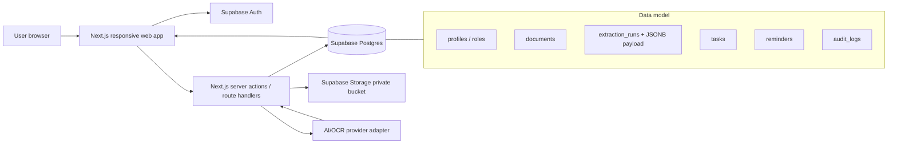

# DayKeeper Group 1 - Technical Stack Recommendation

Date: 31 July 2026  
Author: Sai / Group 1 working note  
Status: Draft for team discussion  
Amended: 2 August 2026 (review pass)

## 1. Executive Recommendation

DayKeeper should be built as a **responsive web application**, not a native mobile app. The recommended stack is:

| Layer | Recommended choice | Why |
|---|---|---|
| Web framework | **Next.js + TypeScript + App Router** | Full-stack React framework, good for dashboards, route handlers, server components, and fast prototyping. Official docs list Next.js as a framework for full-stack web apps and current docs use the App Router path. |
| UI | **Tailwind CSS + shadcn/ui + lucide-react** | Fast dashboard UI, accessible components, consistent design, minimal custom CSS. |
| Auth | **Supabase Auth** | Fastest way to implement login, sessions, JWT, and future role-based access. Integrates naturally with Supabase RLS. |
| Authorization | **Postgres Row Level Security (RLS) + app-level roles** | Important because documents may contain private/medical/financial information. RLS gives database-level defense. |
| Database | **Supabase Postgres** | Matches the proposed architecture: relational core tables + JSONB extraction payload. |
| File storage | **Supabase Storage private bucket** | Uploaded documents should not be stored directly in the database. Storage policies can use RLS. |
| AI/OCR integration | **Provider adapter layer**: RMIT/AWS Bedrock (RACE) primary, OpenAI-compatible API fallback, mock provider default until keys arrive | Do not lock the app to one model provider before resource access is confirmed. |
| AI output contract | **Zod schema + JSON Schema / Structured Output** | Extraction output must be predictable: fields, statuses, evidence, and user-confirmation state. |
| Background work | **Start simple: Next.js route handler + status table. Escape hatch: database webhook into a Supabase Edge Function** | OCR/LLM extraction can take time; UI should show processing status instead of blocking. No Redis on the free tier, so BullMQ is out of scope. |
| Reminders/notifications | **pg_cron + scheduled Edge Function + in-app notification center, email via Resend free tier** | Vercel Hobby cron fires at most once per day, so the scheduler must live in Supabase. |
| Evaluation layer | **Offline Python workspace (uv, pytest, opencv, Augraphy)** | Scores extraction quality against labelled fixtures; never deployed, costs nothing. See the Evaluation section. |
| Testing | **Vitest + Playwright** | Unit/schema tests for contracts and E2E tests for upload-confirm-reminder flows. |
| Deployment | **Vercel + Supabase for MVP**, or **Docker self-hosting** if client/RMIT requires it | Vercel/Supabase is fastest. Docker path is safer if hosting must be controlled by RMIT/client. |

Short version: **Next.js + TypeScript + Supabase Auth/Postgres/Storage + Tailwind/shadcn + Zod + Playwright, plus an offline Python evaluation workspace.**

## 2. Project Requirements That Drive the Stack

The technology choices should fit these product requirements:

- The product is a **website** usable on mobile, tablet, and desktop.
- Phase 1 focuses on:
  - Module 1: document photo upload and AI extraction.
  - Module 4: unified archive, tasks, reminders, user registration, admin dashboard.
- Uploaded documents may contain sensitive information.
- AI extraction can be wrong, so the app must support:
  - `confirmed`
  - `uncertain`
  - `unreadable`
  - user correction before task/reminder generation.
- Future scope may include:
  - Email channel.
  - Voice/call channel.
  - Organization/admin dashboard.
  - Permissioned worker access to client records.

This means we should avoid a toy frontend-only app. We need auth, storage, database permissions, structured extraction, and an auditable workflow.

## 3. Recommended Architecture



## 4. Frontend Choice

### Recommended: Next.js + TypeScript

Use:

- `Next.js`
- `TypeScript`
- `App Router`
- `src/` directory
- `pnpm`

Why:

- Next.js is designed for full-stack React web applications, so one project can contain UI pages, server-side handlers, and API routes.
- App Router is the newer routing model and supports modern React features such as Server Components.
- This project is dashboard-heavy, not animation-heavy, so Next.js is a strong fit.

Suggested setup:

```bash
pnpm create next-app@latest day-keeper-group-1 --src-dir
```

Recommended options:

- TypeScript: yes
- ESLint: yes
- Tailwind: yes
- App Router: yes
- Import alias: `@/*`

### UI styling

Use:

- `Tailwind CSS`
- `shadcn/ui`
- `lucide-react`

Why:

- Tailwind is fast for responsive dashboard layout.
- shadcn/ui gives ready-made components such as buttons, dialogs, forms, tabs, tables, badges, dropdowns, and calendars.
- lucide-react gives clean icons for upload, scan, calendar, alert, check, admin, and document actions.

Do not over-design the UI as a marketing landing page. DayKeeper is an operational dashboard: documents, tasks, reminders, review states, and admin panels should be easy to scan.

### PWA and text scale

- Ship a web app manifest and installability from the start. It costs nothing, gives users a home screen icon, and is the prerequisite for web push on iOS later.
- shadcn defaults are tuned for dense professional dashboards. Raise the base type scale and spacing globally in the design tokens for this product's audience. Do it once in the tokens, not per component.

## 5. Authentication And Authorization

### Recommended auth: Supabase Auth

Supabase Auth is the best default for this project because it gives:

- email/password login
- magic link / OTP option if needed
- JWT sessions
- integration with Postgres
- integration with RLS
- easier future support for organization-level access

Suggested roles:

| Role | Meaning |
|---|---|
| `user` | Normal DayKeeper user. Uploads own documents and confirms tasks. |
| `org_worker` | Worker from an organization who can access only authorized clients. Future scope. |
| `org_admin` | Organization-level admin. Manages workers/clients. Future scope. |
| `platform_operator` | System operator. Can view operational health, not private user document content by default. |

Suggested tables:

```text
profiles
organizations
organization_memberships
documents
document_permissions
extraction_runs
tasks
reminders
notifications
audit_logs
extraction_logs
```

Naming note: extraction_logs was ai_prompt_logs in the first draft. Renamed to avoid confusion with docs/ai-prompts, which is a different thing: the table stores runtime prompts and outputs sent to providers, for debugging and evaluation; the folder stores the team's AI usage records for the course GenAI declaration.

Migration note: organizations and organization_memberships stay in this list as design headroom but are not created in the initial migrations. Organization features are future scope; keying everything through profiles keeps that door open without carrying empty tables.

Important rule:

> Authentication answers "who is this user?" Authorization answers "what is this user allowed to see or do?"

For this project, authorization is more important than usual because documents may include bills, medical letters, government forms, and personal information.

### Database access pattern (decision to confirm)

RLS is only a real defense when queries carry the user's identity. Two safe patterns:

1. The browser talks to Supabase with the anon key; RLS is the primary gate.
2. Server code builds a per-request client with the user's JWT, so queries still run as that user.

The service role key bypasses RLS entirely. It must never appear in general request handlers. Quarantine it in one small admin module with its own review rule. The test "another user cannot view the document" in the testing section is what keeps this honest.

One more free tier consequence: disable email confirmation for the MVP, or wire custom SMTP through Resend. The Supabase free tier sends only a handful of auth emails per hour, which is not enough for a live demo signup flow.

### Why Supabase Auth over Auth.js?

Auth.js is a good option, especially with the Prisma adapter, but for DayKeeper it creates more work:

- You still need to design database authorization.
- You still need private file storage.
- You still need organization membership access control.
- You still need to protect uploaded documents.

Supabase Auth + RLS + Storage solves more of the project surface in one consistent system.

### When to choose Auth.js instead

Choose **Auth.js + Prisma + self-hosted Postgres** only if:

- the client/RMIT does not allow Supabase,
- deployment must be fully self-hosted,
- the team wants all database access to go only through the Next.js server,
- or the project requires a custom auth flow Supabase does not support.

If using Auth.js, the recommended stack becomes:

```text
Next.js
Auth.js
Prisma
PostgreSQL
S3-compatible storage
Docker
```

This is more flexible but slower to implement.

## 6. Database Design

### Recommended: Postgres with relational tables + JSONB

Use relational tables for stable product entities:

- users/profiles
- organizations
- documents
- tasks
- reminders
- permissions
- audit logs

Use `JSONB` for variable extraction payload:

```text
documents
  id
  owner_id
  storage_path
  document_type
  created_at

extraction_runs
  id
  document_id
  provider
  model
  status
  contract_json jsonb
  raw_output jsonb
  created_at
```

Why JSONB:

- A bill, medical letter, insurance document, and government form do not share the exact same schema.
- The action core should be typed.
- Extra extracted fields can live in a flexible payload.
- Postgres JSONB supports querying and indexing if needed.

### Contract JSON

Every extraction result should follow a strict contract:

```json
{
  "document_type": {
    "value": "utility_bill",
    "raw_text": "Electricity bill",
    "status": "confirmed",
    "evidence": {
      "page": 1,
      "bbox": [10, 20, 200, 80]
    }
  },
  "issuer": {
    "value": "Energy Provider",
    "raw_text": "Energy Provider Pty Ltd",
    "status": "confirmed",
    "evidence": {
      "page": 1,
      "bbox": [15, 25, 220, 60]
    }
  },
  "action_required": {
    "value": "Pay bill",
    "raw_text": "Please pay by the due date",
    "status": "confirmed",
    "evidence": {
      "page": 1,
      "bbox": [20, 300, 500, 80]
    }
  },
  "due_date": {
    "value": "2026-08-15",
    "raw_text": "15/08/26",
    "status": "uncertain",
    "evidence": {
      "page": 1,
      "bbox": [300, 450, 120, 40]
    }
  },
  "amount": {
    "value": "125.40",
    "raw_text": "$125.40",
    "status": "confirmed",
    "evidence": {
      "page": 1,
      "bbox": [320, 500, 120, 40]
    }
  },
  "reference": {
    "value": "REF123456",
    "raw_text": "Reference: REF123456",
    "status": "confirmed",
    "evidence": {
      "page": 1,
      "bbox": [30, 540, 220, 40]
    }
  }
}
```

Use `Zod` in the codebase to validate this at runtime. TypeScript alone is not enough because AI output and API responses are untrusted runtime data.

## 7. AI/OCR Stack

### Recommended design: provider adapter

Do not directly scatter OpenAI/Claude/Bedrock calls across the app. Create one interface:

```ts
export interface DocumentExtractionProvider {
  extract(input: {
    documentId: string
    storagePath: string
    documentHint?: string
  }): Promise<ContractJson>
}
```

The adapter fetches file bytes server-side from storage. Signed URLs must not be handed to external providers: that would send user documents outside our infrastructure as links, and Bedrock-style APIs want bytes anyway.

Then implement adapters:

```text
providers/bedrock-extraction.ts   primary target (RMIT RACE)
providers/openai-extraction.ts    fallback if the RACE route changes
providers/mock-extraction.ts      default until real keys arrive
```

Use `mock-extraction.ts` first so frontend and backend can be developed before real API keys arrive.

A separate Python API service was considered and rejected for the MVP: it adds a second deployment surface for a call that is one HTTP request in either language. Python earns its seat in the evaluation layer instead (see the Evaluation section).

### Recommended AI output mode

Use structured output where available:

- OpenAI Responses API with image input and Structured Outputs.
- Bedrock / Claude equivalent if RMIT provides that route.
- Always validate final output with Zod before saving.

Critical rule:

> The model is allowed to say uncertain or unreadable. It should not guess.

### OCR/vision pipeline for MVP

Recommended simple pipeline:

```text
Upload document
-> store original file
-> create extraction_run(status = queued)
-> call AI/OCR provider
-> validate Contract JSON with Zod
-> save extraction result
-> show confirm screen
-> user confirms/corrects
-> generate task/reminder
```

Optional later improvements:

- blur detection before sending image to AI
- OCR second opinion
- model comparison experiments
- synthetic test documents
- human-labelled evaluation set

## 8. File Storage

Do not store uploaded document files directly inside Postgres.

Recommended:

- Supabase Storage private bucket: `documents`
- Store only `storage_path` and metadata in Postgres.
- Use signed URLs or authenticated storage access.
- Apply RLS policies to storage objects.

Suggested storage path:

```text
documents/{user_id}/{document_id}/original.{ext}
documents/{user_id}/{document_id}/preview.webp
```

### Upload normalization (before anything else sees the image)

Normalize every upload in one pass:

- convert HEIC to a web format (sharp built with libheif support)
- apply EXIF orientation, then strip it
- downscale the longest edge to about 1600 px and store a webp working copy alongside the original

One code path, three wins: the 1 GB free storage budget stretches roughly 10x, AI calls get faster and cheaper, and iPhone photos stop arriving sideways.

## 9. Background Jobs

Document extraction should not block the browser request for too long.

### MVP approach

Use:

- `extraction_runs.status`
- Next.js route handler to start extraction
- polling from UI every few seconds

Statuses:

```text
queued
processing
needs_review
failed
confirmed
```

### Escape hatch (decided; switch on measured numbers)

If real extraction latency breaches the Vercel function ceiling, move the AI call off Vercel entirely: a database webhook on `extraction_runs` insert triggers a Supabase Edge Function, which runs the extraction and writes the result back. The UI keeps polling the same status column and never notices the difference.

Until then, set an explicit `maxDuration` on the extraction route and downscale images before calling the provider (see Upload normalization). The decision point is fixed: as soon as real provider keys arrive, measure latency and pick the venue on those numbers.

BullMQ + Redis is out of scope for this project: there is no free seat for Redis, and the Edge Function path covers the same need without new infrastructure.

### Reminders and notifications

Vercel Hobby cron fires at most once per day, which is useless for reminders. The scheduler therefore lives in Supabase:

- pg_cron scans for due tasks hourly
- a scheduled Edge Function turns hits into notification rows and sends email
- channels for the MVP: in-app notification center first (the notifications table plus an unread badge), email through the Resend free tier second, web push later (the PWA manifest is its prerequisite)

## 10. Deployment Options

### Recommended for MVP: Vercel + Supabase

Best if the goal is a fast prototype:

- Vercel hosts Next.js.
- Supabase hosts database, auth, storage.
- RMIT/client API keys are stored in environment variables.

Pros:

- fastest setup
- minimal server management
- good demo experience
- easy preview deployments

Cons:

- must confirm data/privacy requirements
- may not satisfy client/RMIT hosting constraints

### Free tier operations (read before demo week)

- Supabase free projects pause after about a week of inactivity. A paused database on demo day is the classic failure of this stack. Zero-cost fix: a scheduled GitHub Actions workflow pings the project weekly.
- Register Vercel, Supabase and Resend under a team address, not anyone's personal account. The project must hand over cleanly at semester end.
- Keep the Docker Compose file working from mid-project onwards. It is the exit if hosting constraints change, and it should not be written for the first time in week 12.

### Alternative: Docker self-hosted

Use if client/RMIT requires controlled hosting:

```text
Docker Compose
  nextjs-app
  postgres
  redis optional
  minio optional
```

Pros:

- more control
- easier to explain as portable deployment
- no vendor lock-in

Cons:

- slower setup
- team must manage auth/session/storage more carefully
- deployment is more work

## 11. Evaluation And Experiments (Python, Offline)

The app runtime is TypeScript end to end. Alongside it, the repo carries an offline evaluation workspace in Python (managed with uv), because the tooling for this layer lives in Python: image degradation libraries such as Augraphy, opencv and Pillow for image quality measurement, pytest for harness discipline.

What it is for:

- scoring extraction output against labelled fixtures: per-field accuracy, and false positives on documents that require no action
- comparing providers, models and prompts before changing adapter defaults
- generating and checking synthetic test fixtures (the AI/OCR section already lists these as a planned improvement)

The boundary is the Contract JSON: the harness consumes exactly what the adapter emits. It is not deployed, costs nothing to host, and any team member can run it locally. Its results feed back into the app only as configuration: prompt text, model choice, few-shot examples.

One promotion this implies: the Contract JSON should move out of this document into code. Define it once as a Zod schema, generate a JSON Schema export for the Python side, and version changes through pull requests. A contract that lives as an example in a stack document will drift; a contract that lives as code fails loudly.

## 12. Testing Strategy

Use three levels:

| Test type | Tool | What to test |
|---|---|---|
| Schema/unit tests | Vitest | Contract JSON validation, due-date parsing, status transitions. |
| Component tests | Vitest + Testing Library | Confirm box, task card, reminder form, role-based UI states. |
| E2E tests | Playwright | Login, upload document, extraction result appears, user confirms, task/reminder created. |

All tests run against the mock provider in CI, so results stay deterministic and free.

Minimum tests before demo:

- User can sign up/sign in.
- User can upload a document.
- Extraction result can be shown as uncertain.
- User can correct a due date.
- Confirming creates a task/reminder.
- Another user cannot view the document.
- Admin/operator views do not expose private document content unless permission allows it.

## 13. Suggested Folder Structure

```text
day-keeper-group-1/
  src/
    app/
      (auth)/
      (dashboard)/
      api/
    components/
      ui/
      documents/
      tasks/
      reminders/
      admin/
    lib/
      auth/
      supabase/
      validation/
      ai/
      storage/
    server/
      documents/
      tasks/
      reminders/
      extraction/
    types/
  supabase/
    migrations/
    seed.sql
  tests/
    e2e/
    unit/
  docs/
    architecture/
    ai-prompts/
    meeting-minutes/
```

## 14. Team Workflow

Use GitHub with:

- branch per feature
- pull requests
- code review before merge
- GitHub Issues or Jira ticket link in PR description
- AI prompt logs saved in `docs/ai-prompts/`

Recommended branch naming:

```text
feature/auth-login
feature/document-upload
feature/extraction-contract
feature/confirm-box
feature/task-reminders
feature/admin-dashboard
fix/rls-document-access
```

Recommended PR checklist:

```markdown
## What changed

## How to test

## AI usage
- Prompt/tool used:
- What AI generated:
- What I changed/verified:

## Jira ticket
```

## 15. What Not To Do

Avoid these choices for Phase 1:

- Do not build a native mobile app.
- Do not make the product a chatbot-first interface.
- Do not put uploaded files directly in Postgres.
- Do not call AI APIs directly from the frontend.
- Do not create a microservice architecture at the beginning.
- Do not introduce Module 2 and Module 3 into the core MVP before Module 1 and Module 4 work.
- Do not automatically execute high-risk actions from AI output without user confirmation.
- Do not rely only on model confidence scores.
- Do not use personal API keys or personal paid cloud resources.

## 16. Recommended MVP Milestones

### Milestone 1: Project foundation

- Next.js app created.
- Supabase project created.
- Auth working.
- Basic dashboard layout.
- GitHub/Jira workflow ready.

### Milestone 2: Document upload and archive

- User uploads file.
- File stored in private bucket.
- Document record created.
- User sees document archive.

### Milestone 3: Extraction contract

- Contract JSON schema created with Zod.
- Mock extraction provider implemented.
- Extraction result saved to database.
- Exit check: as soon as real provider keys arrive, measure extraction latency and decide the extraction venue (route handler vs Edge Function) on measured numbers.

### Milestone 4: Confirm box

- User sees extracted fields.
- Uncertain/unreadable fields are highlighted.
- User can correct values.
- Corrections are stored.

### Milestone 5: Tasks and reminders

- Confirmed extraction creates task/reminder.
- User can edit/complete tasks.
- Dashboard shows upcoming deadlines.

### Milestone 6: Admin/operator prototype

- Admin dashboard exists.
- Platform operator can see system status.
- Organization features remain clearly marked as future/optional unless client prioritizes them.

## 17. Decision Summary

The best default stack is:

```text
Next.js
TypeScript
Tailwind CSS
shadcn/ui
Supabase Auth
Supabase Postgres
Supabase Storage
Zod
OpenAI/RMIT Bedrock provider adapter
Vitest
Playwright
Vercel or Docker deployment
Offline Python evaluation workspace (uv)
```

The most important design decision is not the exact model provider. It is this:

> DayKeeper must be built around user confirmation, permissioned access, and structured extraction data.

If the team gets those foundations right, the AI model can be swapped later.

## 18. Sources Checked

- Next.js docs: https://nextjs.org/docs
- Tailwind CSS with Next.js: https://tailwindcss.com/docs/installation/framework-guides/nextjs
- shadcn/ui Next.js installation: https://ui.shadcn.com/docs/installation/next
- Supabase Auth docs: https://supabase.com/docs/guides/auth
- Supabase Row Level Security docs: https://supabase.com/docs/guides/database/postgres/row-level-security
- Supabase Storage access control docs: https://supabase.com/docs/guides/storage/security/access-control
- PostgreSQL JSON/JSONB docs: https://www.postgresql.org/docs/current/datatype-json.html
- OpenAI image/vision docs: https://developers.openai.com/api/docs/guides/images-vision
- OpenAI Structured Outputs docs: https://developers.openai.com/api/docs/guides/structured-outputs
- Supabase background tasks docs: https://supabase.com/docs/guides/functions/background-tasks
- Auth.js Prisma Adapter docs: https://authjs.dev/getting-started/adapters/prisma
- Zod docs: https://zod.dev/
- Playwright docs: https://playwright.dev/docs/intro
- Vercel cron jobs usage and limits: https://vercel.com/docs/cron-jobs/usage-and-pricing
- Vercel function max duration: https://vercel.com/docs/functions/configuring-functions/duration
- Supabase pg_cron docs: https://supabase.com/docs/guides/database/extensions/pg_cron
- Supabase pricing and free project pausing: https://supabase.com/pricing
- Resend pricing: https://resend.com/pricing
- sharp image processing: https://sharp.pixelplumbing.com/
- Augraphy: https://github.com/sparkfish/augraphy
- uv: https://docs.astral.sh/uv/
